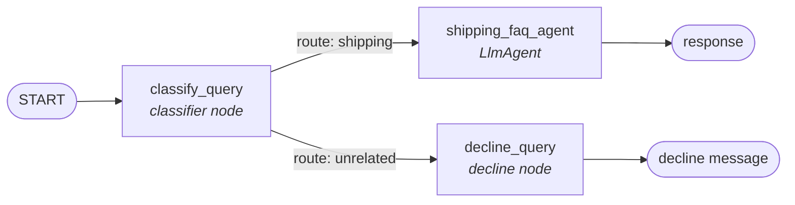

# Smart-Route-Agent (ADK 2.0 Graph Workflow)

Customer Support Agent for a shipping company, built with
[Google's Agent Development Kit (ADK) 2.0](https://google.github.io/adk-docs/).
The agent classifies an incoming user query and deterministically routes it to
either a shipping FAQ agent or a polite decline response.

## Problem

Customer support inboxes for a shipping company receive a mix of queries:

- **On-topic**: shipping rates, package tracking, delivery estimates, returns.
- **Off-topic**: anything unrelated to the company's shipping service.

A single, unconstrained LLM agent handling all incoming messages tends to be
unpredictable — it may attempt to answer questions outside its scope, or
handle "in-scope vs. out-of-scope" inconsistently between runs. We want
deterministic, auditable routing: a query is *always* classified first, and
the classification *always* decides which downstream behavior runs — the LLM
is never trusted to make that judgment call on its own mid-conversation.

## Solution

The agent is built as an ADK 2.0 **graph workflow** rather than a single
freeform agent. Control flow (routing) is handled by the workflow graph in
code, while natural-language understanding (classification, answering) is
delegated to LLM-backed nodes. This keeps the routing logic deterministic and
testable, while still using an LLM where it's actually needed.

1. A **classifier node** (`classify_query`) inspects the user's query and
   labels it `shipping` or `unrelated`.
2. Based on that label, the **workflow graph** routes to exactly one of:
   - **`shipping_faq_agent`** — an `LlmAgent` that answers shipping questions
     about rates, tracking, delivery, and returns.
   - **`decline_query`** — a deterministic node that returns a polite decline
     message for anything off-topic.

Because routing is a graph edge, not a decision the LLM is allowed to make
inline, an off-topic query can never accidentally get an in-scope answer (or
vice versa) — the graph structurally prevents it.

## Architecture



| Component | Type | Responsibility |
|---|---|---|
| `classify_query` | `@node` function | Calls Gemini to classify the query as `shipping` or `unrelated`, sets `ctx.route` accordingly. |
| `shipping_faq_agent` | `LlmAgent` | Answers shipping-related questions (rates, tracking, delivery, returns). |
| `decline_query` | `@node` function | Returns a fixed, polite decline message for off-topic queries. |
| `root_agent` | `Workflow` | Wires the above into a graph: `START → classify_query → {shipping_faq_agent \| decline_query}`. |
| `app` | `App` | Wraps `root_agent` for the ADK runtime, playground, and evaluation tooling. |

### Why a workflow graph instead of a single agent?

- **Deterministic routing** — the classification result directly drives a
  graph edge, evaluated in code, not re-interpreted by an LLM downstream.
- **Prompt isolation** — `shipping_faq_agent` only ever sees the user's query;
  it's never exposed to classification instructions or unrelated history.
- **Testability** — each node/agent can be tested and mocked in isolation
  (see `tests/test_agent.py`).

## Repository structure

```
customer-support-agent/
├── app/
│   ├── __init__.py
│   └── agent.py          # root_agent / App definition (the workflow graph)
├── tests/
│   └── test_agent.py     # routing tests with mocked model calls
├── requirements.txt
├── .env.example
├── .gitignore
└── README.md
```

## Setup instructions

### Prerequisites

- Python 3.10+
- A Gemini API key from [Google AI Studio](https://aistudio.google.com/apikey)
  (or a configured Vertex AI project)

### 1. Clone the repository

```bash
git clone https://github.com/Naheemah-babs/smart-route-agent.git
cd smart-route-agent
```

### 2. Create a virtual environment and install dependencies

```bash
python3 -m venv .venv
source .venv/bin/activate   # Windows: .venv\Scripts\activate
pip install -r requirements.txt
```

### 3. Configure your API key

```bash
cp .env.example .env
```

Edit `.env` and set `GOOGLE_API_KEY` to your Gemini API key (or set the
Vertex AI variables if you're using Vertex instead).

### 4. Run the agent locally

Using the ADK CLI's interactive playground:

```bash
adk web
```

This opens a local web UI where you can chat with the agent and inspect the
graph execution. Alternatively, run it from the command line:

```bash
adk run app
```

### 5. Run the tests

Tests mock all model calls, so no API key or quota is needed to run them:

```bash
pytest tests/ -v
```

Expected output:

```
tests/test_agent.py::test_shipping_query_routing PASSED
tests/test_agent.py::test_unrelated_query_routing PASSED
```

## Example interactions

| Input | Route | Output |
|---|---|---|
| "What are your shipping rates to Canada?" | `shipping` | Answered by `shipping_faq_agent` |
| "Where is my package?" | `shipping` | Answered by `shipping_faq_agent` |
| "Why is the sky blue?" | `unrelated` | Polite decline message |

## Notes / limitations

- Classification currently uses a direct `genai.Client()` call with a plain
  string check for `"shipping"` in the model's response. This is simple and
  works, but a stricter approach — an `LlmAgent` with a structured
  `output_schema` (e.g. a Pydantic model with a `Literal["shipping",
  "unrelated"]` field) — would be more robust against ambiguous model output
  and is a natural next improvement.
- This project intentionally skips deployment configuration (e.g. Agent
  Runtime / Cloud Run manifests) per the assignment scope — it's meant to run
  locally via `adk web` / `adk run`.

## License

Apache License 2.0 — see [LICENSE](LICENSE).
